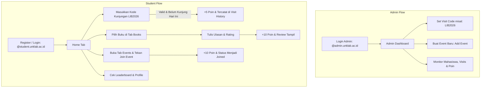

# 📚 UNKLAB Library Mobile Application

> **Aplikasi Mobile Perpustakaan Universitas Klabat dengan Sistem Gamifikasi & Poin Rewards**  
> Proyek Tengah Semester (*Mid Project / UTS*) — **Mobile Application Development (MAD)**  
> **Universitas Klabat (UNKLAB)**

---

## 📌 Daftar Isi
1. [Tentang Proyek](#-tentang-proyek)
2. [Fitur Utama](#-fitur-utama)
   - [Modul Mahasiswa (Student)](#1-modul-mahasiswa-student)
   - [Modul Administrator (Admin)](#2-modul-administrator-admin)
3. [Sistem Gamifikasi & Perhitungan Poin](#-sistem-gamifikasi--perhitungan-poin)
4. [Teknologi yang Digunakan (Tech Stack)](#-teknologi-yang-digunakan-tech-stack)
5. [Skema Basis Data (Convex Database Schema)](#-skema-basis-data-convex-database-schema)
6. [Struktur Direktori Proyek](#-struktur-direktori-proyek)
7. [Panduan Instalasi & Menjalankan Aplikasi](#-panduan-instalasi--menjalankan-aplikasi)
8. [Panduan Akun & Pengujian (Demo Guide)](#-panduan-akun--pengujian-demo-guide)
9. [Kontributor](#-kontributor)

---

## 📖 Tentang Proyek

**UNKLAB Library Mobile Application** adalah aplikasi mobile berbasis **React Native** dan **Expo** yang dirancang untuk mendigitalisasi dan meningkatkan keterlibatan mahasiswa (*student engagement*) terhadap fasilitas perpustakaan di lingkungan **Universitas Klabat**.

Aplikasi ini tidak hanya berfungsi sebagai katalog buku digital dan informasi kegiatan literasi, tetapi juga menyematkan **mekanisme gamifikasi reward**: mahasiswa yang aktif mengunjungi perpustakaan, membaca, memberikan ulasan buku, serta mengikuti event literasi kampus akan memperoleh poin yang dapat dikonversikan menjadi nilai bonus akhir mata kuliah (*final grade bonus*).

Seluruh sistem data berjalan secara *real-time* memanfaatkan **Convex Backend-as-a-Service**, menghadirkan sinkronisasi instan antara input administrator dan tampilan mahasiswa.

---

## ✨ Fitur Utama

### 1. Modul Mahasiswa (*Student*)
* **Autentikasi & Validasi Domain Kampus**:
  * Pendaftaran dan login akun mahasiswa yang mewajibkan domain email resmi `@student.unklab.ac.id`.
  * Pencatatan data identitas mahasiswa (Nama Lengkap, NIM, dan Fakultas).
* **Presensi Kunjungan Harian (*Daily Library Visit Check-in*)**:
  * Mahasiswa memasukkan kode verifikasi kunjungan harian yang diatur oleh Admin di perpustakaan.
  * Mahasiswa mendapatkan **+5 Poin** setiap berhasil presensi.
  * Dilengkapi validasi pencegahan duplikasi: mahasiswa hanya dapat melakukan klaim kunjungan 1 kali per hari (*calendar day*).
* **Katalog Buku & Rekomendasi (*Book Catalog & Recommendations*)**:
  * Menampilkan buku rekomendasi dalam carousel horizontal di beranda (*Home*).
  * Menampilkan daftar lengkap koleksi perpustakaan dengan informasi judul, penulis, dan kategori fakultas.
* **Detail Buku & Sistem Ulasan (*Reviews & Ratings*)**:
  * Melihat sinopsis dan rincian buku.
  * Mahasiswa dapat memberikan rating bintang (1–5) serta komentar ulasan.
  * Setiap pengiriman ulasan memberikan reward **+10 Poin** kepada mahasiswa.
  * Daftar ulasan dari mahasiswa lain ditampilkan secara real-time.
* **Event Kampus & Registrasi (*Events & Registration*)**:
  * Jadwal kegiatan literasi, seminar, dan workshop kampus.
  * Mahasiswa dapat mendaftar (*Join Event*) dan langsung memperoleh reward **+10 Poin**.
  * Dilengkapi status interaktif (*Join Event* berubah menjadi *✓ Joined* untuk mencegah pendaftaran ganda).
* **Papan Peringkat Real-Time (*Leaderboard*)**:
  * Peringkat *Top 10* mahasiswa dengan akumulasi perolehan poin tertinggi di kampus.
* **Profil & Riwayat Gamifikasi (*Profile, Points & Visits History*)**:
  * Rincian akun mahasiswa (Nama, NIM, Fakultas, Email).
  * Statistik poin dan kalkulasi otomatis nilai bonus akhir (*Bonus Grade*).
  * Halaman **Points History**: daftar riwayat aktivitas perolehan poin beserta nominal dan tanggal.
  * Halaman **Visit History**: log riwayat tanggal kunjungan ke perpustakaan.
* **Indikator Notifikasi**:
  * Ikon lonceng notifikasi pada header dengan badge penghitung unread items.

---

### 2. Modul Administrator (*Admin*)
* **Autentikasi Khusus Admin**:
  * Login akun admin dengan validasi domain resmi `@admin.unklab.ac.id`.
  * Akses eksklusif ke rute dashboard admin dengan proteksi otorisasi *Role-Based Access Control* (RBAC).
* **Manajemen Kode Kunjungan Harian (*Set Visit Code*)**:
  * Admin dapat membuat dan memperbarui kode kunjungan (contoh: `LIB2026`, `UNKLAB123`) yang valid digunakan oleh mahasiswa pada hari tersebut.
* **Monitoring Pengguna (*View Users*)**:
  * Melihat seluruh data mahasiswa terdaftar beserta akumulasi poin dan perolehan nilai bonus masing-masing mahasiswa.
* **Monitoring Presensi Kunjungan (*View Visits*)**:
  * Rekapitulasi log seluruh kunjungan mahasiswa ke perpustakaan secara transparan lengkap dengan nama mahasiswa dan waktu kunjungan.
* **Monitoring Transaksi Poin (*View Points*)**:
  * Audit riwayat pemberian poin untuk semua jenis aktivitas mahasiswa (kunjungan, ulasan buku, dan partisipasi event).
* **Manajemen Event Kampus (*Add & View Events*)**:
  * Formulir penerbitan event baru: Judul, Deskripsi, dan Tanggal kegiatan (`YYYY-MM-DD`).
  * Monitoring event dan daftar mahasiswa yang telah mendaftar (*Event Participants*) secara real-time.

---

## 🏆 Sistem Gamifikasi & Perhitungan Poin

| Aktivitas Mahasiswa | Poin yang Diperoleh | Ketentuan / Batasan |
| :--- | :---: | :--- |
| **Kunjungan Perpustakaan** | **+5 Poin** | Maksimal 1 kali klaim per hari |
| **Ulasan & Rating Buku** | **+10 Poin** | Setiap ulasan buku yang berhasil dikirim |
| **Mengikuti Event Literasi** | **+10 Poin** | 1 kali klaim per event yang diikuti |

### 🎓 Formula Nilai Bonus (*Bonus Grade*)
Mahasiswa dapat mengumpulkan poin untuk memperoleh nilai bonus tambahan pada evaluasi akademik:

$$\text{Bonus Grade} = \left\lfloor \frac{\text{Total Poin}}{1000} \right\rfloor$$

* Setiap kelipatan **1.000 poin**, mahasiswa berhak mendapatkan **+1 nilai bonus akhir**.
* Contoh:
  * 950 Poin $\rightarrow$ Bonus: `+0`
  * 1.050 Poin $\rightarrow$ Bonus: `+1`
  * 2.400 Poin $\rightarrow$ Bonus: `+2`

---

## 🛠 Teknologi yang Digunakan (Tech Stack)

### Frontend (Mobile App)
* **Framework**: [React Native](https://reactnative.dev/) (v0.81.5) & [Expo](https://expo.dev/) (SDK 54)
* **Routing**: [Expo Router v6](https://docs.expo.dev/router/introduction/) *(File-based routing with Typed Routes)*
* **Language**: [TypeScript](https://www.typescriptlang.org/) (v5.9.2)
* **Navigation**: `@react-navigation/bottom-tabs` & `@react-navigation/native`
* **Icons**: `@expo/vector-icons` (Ionicons)
* **State Management**: React Context API (`AuthContext`)

### Backend & Database
* **Backend Platform**: [Convex](https://www.convex.dev/) (v1.32.0)
* **Database**: Convex Real-Time Document Database (Reactive Queries & Mutations)
* **Schema Validation**: Convex Schema Validator (`convex/values`)

---

## 🗄 Skema Basis Data (Convex Database Schema)

Basis data didefinisikan pada [`convex/schema.ts`](file:///convex/schema.ts):

| Tabel (*Table*) | Kolom (*Fields*) | Indeks (*Indexes*) | Deskripsi |
| :--- | :--- | :--- | :--- |
| `users` | `name`, `nim`, `faculty`, `email`, `password`, `points`, `role`, `createdAt` | `by_email` (`email`) | Akun pengguna (mahasiswa & admin) |
| `books` | `title`, `author`, `faculty`, `category`, `description`, `coverUrl`, `isAvailable`, `createdAt` | `by_faculty` (`faculty`) | Master katalog buku perpustakaan |
| `reviews` | `userId`, `bookId`, `rating`, `comment`, `createdAt` | `by_userId`, `by_bookId` | Ulasan dan rating buku dari mahasiswa |
| `points` | `userId`, `amount`, `activity`, `createdAt` | `by_userId` (`userId`) | Riwayat transaksi penambahan poin |
| `events` | `title`, `description`, `date`, `createdAt` | - | Master data jadwal kegiatan/event perpustakaan |
| `eventParticipants`| `userId`, `eventId`, `joinedAt` | `by_userId`, `by_eventId`, `by_userId_eventId` | Relasi pendaftaran mahasiswa pada event |
| `visits` | `userId`, `date` | `by_userId` (`userId`) | Catatan log presensi kunjungan mahasiswa |
| `visitCodes` | `code`, `createdAt` | `by_code` (`code`) | Master kode verifikasi kunjungan harian |
| `notifications` | `userId`, `message`, `isRead`, `createdAt` | `by_userId` (`userId`) | Data notifikasi pengguna |
| `borrowLogs` | `userId`, `bookId`, `borrowDate`, `returnDate`, `status` | `by_userId`, `by_bookId` | Log peminjaman dan pengembalian buku |

---

## 📂 Struktur Direktori Proyek

```text
Mid_Project/
├── app/                        # Direktori Rute Aplikasi (Expo Router)
│   ├── (tabs)/                 # Bottom Tabs Navigation (Area Mahasiswa)
│   │   ├── _layout.tsx         # Konfigurasi tab bar & icon notifikasi
│   │   ├── home.tsx            # Beranda: welcome, visit check-in, recommended books
│   │   ├── books.tsx           # Katalog koleksi buku perpustakaan
│   │   ├── events.tsx          # Jadwal kegiatan & tombol join event
│   │   ├── leaderboard.tsx     # Peringkat mahasiswa dengan poin tertinggi
│   │   ├── notifications.tsx   # Halaman notifikasi pengguna
│   │   └── profile.tsx         # Info profil, status bonus grade & menu riwayat
│   ├── admin/                  # Modul Khusus Administrator
│   │   ├── menu.tsx            # Dashboard navigasi admin
│   │   ├── setCode.tsx         # Formulir pengaturan kode kunjungan perpustakaan
│   │   ├── users.tsx           # Monitoring seluruh data mahasiswa & poin
│   │   ├── visits.tsx          # Rekapitulasi log seluruh kunjungan mahasiswa
│   │   ├── points.tsx          # Monitoring log perolehan poin mahasiswa
│   │   ├── addEvent.tsx        # Formulir pembuatan event baru
│   │   ├── events.tsx          # Daftar event yang telah dibuat
│   │   └── eventDetail.tsx     # Rincian event & daftar peserta terdaftar
│   ├── auth/                   # Modul Autentikasi
│   │   ├── login.tsx           # Halaman login dengan pemilih role (Student/Admin)
│   │   └── register.tsx        # Halaman registrasi akun dengan validasi email kampus
│   ├── books/                  # Rute Halaman Buku
│   │   ├── _layout.tsx         # Stack header buku
│   │   ├── detail.tsx          # Rincian buku, input review, & list review
│   │   └── review.tsx          # Komponen ulasan buku
│   ├── profile/                # Rute Detail Profil
│   │   ├── points.tsx          # Riwayat detail transaksi poin mahasiswa
│   │   └── visits.tsx          # Riwayat detail kunjungan perpustakaan mahasiswa
│   ├── _layout.tsx             # Root Layout (Convex Provider & Auth Provider)
│   └── index.tsx               # Entry redirector berdasarkan status login & role
├── assets/                     # Aset Gambar & Ikon
│   └── images/
│       ├── logo/logo_unklab.png# Logo resmi Universitas Klabat
│       └── icon.png            # App icon & splash screen
├── context/
│   └── AuthContext.tsx         # State management autentikasi pengguna
├── convex/                     # Backend Convex (Server Functions & Schema)
│   ├── schema.ts               # Definisi tabel, tipe data, dan indeks database
│   ├── users.ts                # Handler register, login, leaderboard, poin
│   ├── books.ts                # Handler katalog dan detail buku
│   ├── events.ts               # Handler event, join event, & peserta event
│   ├── visits.ts               # Handler presensi kunjungan & pengecekan harian
│   ├── visitCodes.ts           # Handler penerbitan kode verifikasi kunjungan
│   ├── points.ts               # Handler pencatatan dan query log poin
│   ├── reviews.ts              # Handler penambahan dan query ulasan buku
│   ├── notifications.ts        # Handler pengiriman notifikasi
│   └── borrowLogs.ts           # Handler peminjaman & pengembalian buku
├── lib/
│   └── convexClient.tsx        # Inisialisasi client instance Convex
├── types/                      # TypeScript definitions & data models
├── .env.local                  # Konfigurasi environment variabel lokal
├── app.json                    # Konfigurasi aplikasi Expo
├── package.json                # Dependencies & script npm
└── tsconfig.json               # Konfigurasi TypeScript compiler
```

---

## 🚀 Panduan Instalasi & Menjalankan Aplikasi

### 1. Prasyarat Sistem
* [Node.js](https://nodejs.org/) (versi 18.x atau lebih baru disarankan)
* [npm](https://www.npmjs.com/) atau [yarn](https://yarnpkg.com/)
* Aplikasi [Expo Go](https://expo.dev/go) pada smartphone Android/iOS atau Emulator Android Studio / iOS Simulator.

### 2. Kloning Repositori
```bash
git clone https://github.com/adrielwalintukan/project-mid-mad.git
cd Mid_Project
```

### 3. Instalasi Dependensi
```bash
npm install
```

### 4. Konfigurasi Environment Variable
Pastikan terdapat file `.env.local` pada direktori *root* proyek dengan konfigurasi URL Convex:
```env
EXPO_PUBLIC_CONVEX_URL=https://<your-convex-deployment>.convex.cloud
EXPO_PUBLIC_CONVEX_SITE_URL=https://<your-convex-deployment>.convex.site
```

### 5. Menjalankan Backend Convex (Mode Development)
Buka terminal dan jalankan backend Convex:
```bash
npx convex dev
```

### 6. Menjalankan Server Aplikasi Expo
Buka terminal baru pada direktori proyek, kemudian jalankan:
```bash
npx expo start
```
* Tekan `a` untuk membuka di **Android Emulator**.
* Tekan `i` untuk membuka di **iOS Simulator**.
* Tekan `w` untuk membuka di **Web Browser**.
* Atau scan **QR Code** yang muncul di terminal menggunakan aplikasi **Expo Go** di smartphone Anda.

---

## 🧪 Panduan Akun & Pengujian (Demo Guide)

### Aturan Format Email & Kredensial:
* **Akun Mahasiswa**:
  * Format Email: `[nama/nim]@student.unklab.ac.id` (Wajib berakhiran `@student.unklab.ac.id`).
  * Field Tambahan: Wajib mengisi **NIM** dan **Fakultas**.
  * Role: Pilih **Student**.
* **Akun Administrator**:
  * Format Email: `[nama]@admin.unklab.ac.id` (Wajib berakhiran `@admin.unklab.ac.id`).
  * Role: Pilih **Admin**.

---

### Alur Skenario Pengujian Sistem:



1. **Persiapan oleh Admin**:
   * Login sebagai **Admin**.
   * Buka menu **Set Visit Code**, masukkan kode baru (contoh: `LIB2026`) lalu tekan *Save Code*.
   * Buka menu **Add Event**, buat kegiatan kampus baru (misal: "Seminar Bedah Buku", tanggal: `2026-05-20`).
2. **Aktivitas Mahasiswa**:
   * Login sebagai **Student**.
   * Pada halaman **Home**, ketik kode `LIB2026` pada kolom *Visit Library* lalu tekan *Visit Library*. Poin bertambah **+5**. Jika diulang pada hari yang sama, sistem akan menolak presensi ganda.
   * Masuk ke tab **Books**, pilih salah satu buku, tulis ulasan dan pilih rating bintang 1–5 lalu tekan *Submit Review*. Poin bertambah **+10**.
   * Masuk ke tab **Events**, pilih event yang dibuat admin lalu tekan **Join Event**. Poin bertambah **+10**.
   * Masuk ke tab **Leaderboard** untuk melihat pergeseran posisi ranking.
   * Masuk ke tab **Profile** untuk melihat kalkulasi nilai bonus akhir (*Bonus Grade*) serta riwayat poin di menu *Points History* dan riwayat presensi di *Visit History*.
3. **Verifikasi Admin**:
   * Kembali ke akun **Admin**, periksa menu **View Users**, **View Visits**, **View Points**, dan **View Events** $\rightarrow$ peserta yang mendaftar akan tampil secara akurat dan *real-time*.

---

## 👨‍💻 Kontributor

* **Nama Mahasiswa**: Adriel Walintukan
* **Program Studi / Fakultas**: Ilmu Komputer / Sistem Informasi — Universitas Klabat
* **Mata Kuliah**: Mobile Application Development (MAD)
* **GitHub**: [@adrielwalintukan](https://github.com/adrielwalintukan)

---

<p align="center">
  <b>Universitas Klabat (UNKLAB)</b><br>
  <i>"Initium Sapientiae Timor Domini"</i>
</p>
